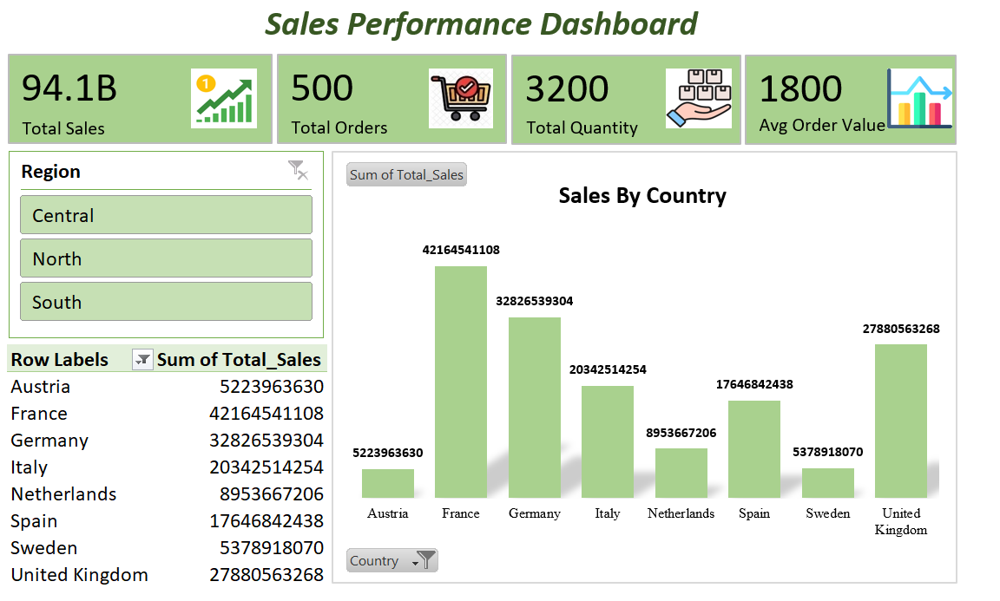

# 📊 Sales Performance Dashboard (Excel Project)

🚀 Interactive Excel Dashboard for Sales Analytics | Data Visualization | Business Insights

---
## 📂 Download Project
👉 [Download Excel Dashboard](Sales_Performance_Dashboard_Excel.xlsx)

---

## 📊 Key Features:
- Interactive dashboard  
- KPI tracking  
- Data visualization using charts  
- Clean and user-friendly design  

---

## 🚀 Skills:
- Data Analysis  
- Dashboard Design  
- Business Intelligence  
- Excel Automation  

---

## 🛠️ Built using:
- Microsoft Excel  
- Pivot Tables  
- Advanced Formulas  
- Charts  

---

## 📸 Dashboard Preview:

### 🔹 Main Dashboard

---

### 🔹 More Views

  
  
  

---

## 💡 Insights:
- Helps in data-driven decision making  
- Easy to use and interactive  
- Suitable for business analytics  

---

## 🔖 Tags:
#Excel #DataAnalytics #Dashboard #DataVisualization #BusinessAnalytics #Portfolio

---

# 🚀 Connect with me
If you like this project, feel free to star ⭐ the repo!
